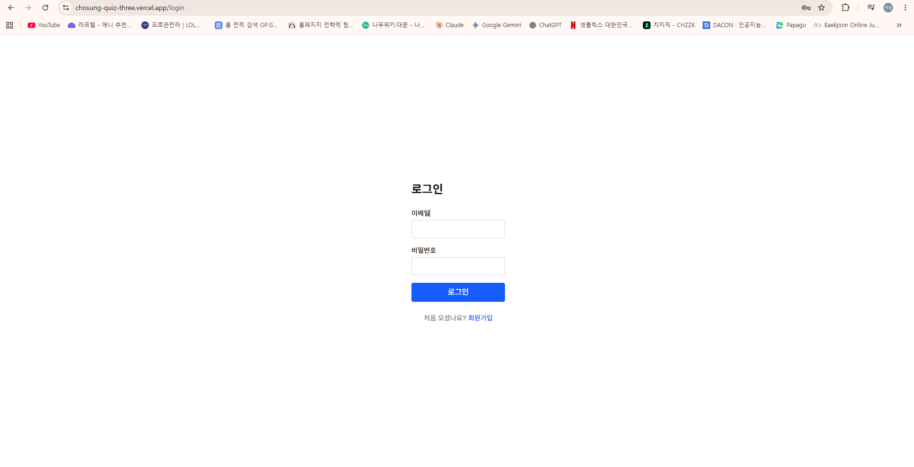
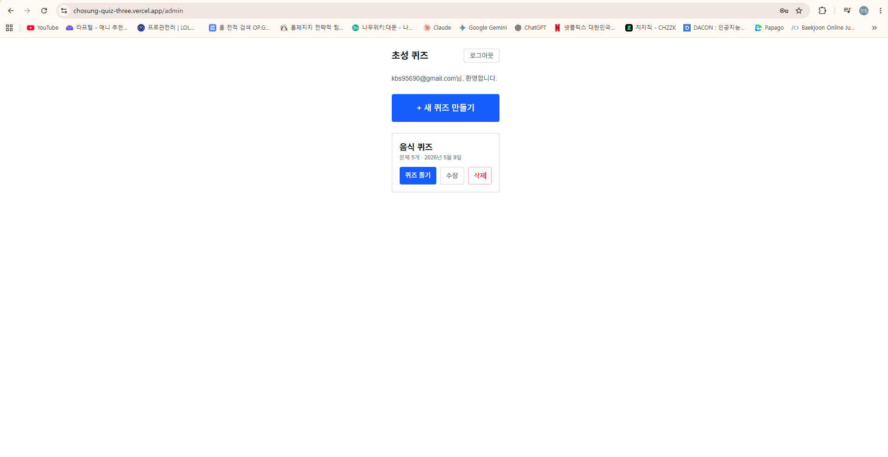
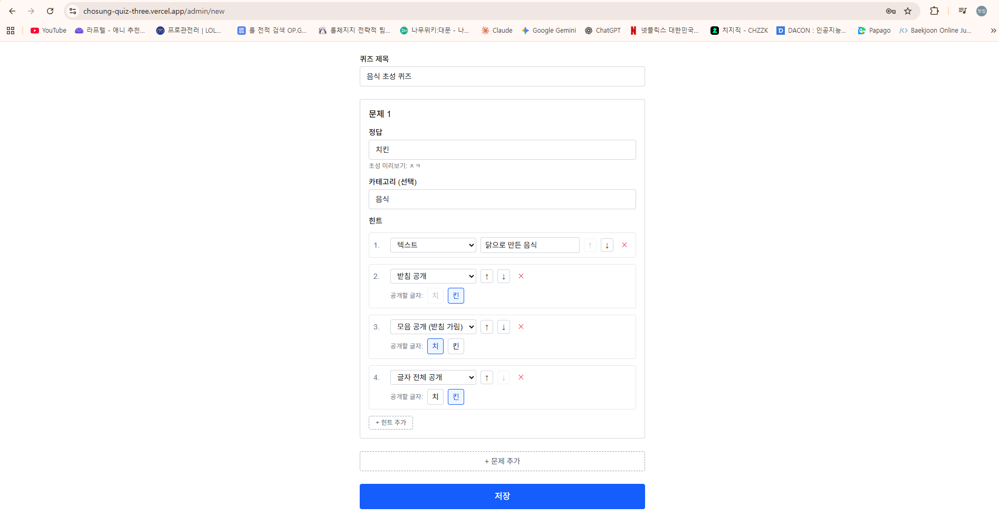
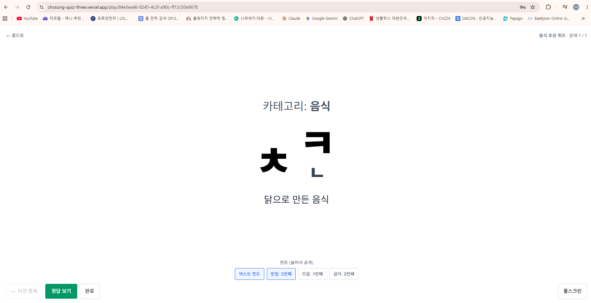

# 초성 퀴즈 — Korean Initial Consonant Quiz for the Classroom

[한국어로 보기 →](README.ko.md)

A web tool for Korean teachers to author and run **chosung** (initial-consonant) quizzes during class. Designed around the inclusive-education context — special-needs students see a clean, fullscreen, high-contrast play screen with no timers, no input, and no distracting effects.

🔗 **[Live Demo](https://chosung-quiz-three.vercel.app)** — sign up freely to try

---

## Screenshots

| Login | Admin list |
|---|---|
|  |  |

| Create form | Play screen |
|---|---|
|  |  |

The play-screen capture shows pattern C jongsung rendering — the final consonant `ㄴ` sits on its own row beneath `ㅋ`, which is how Hangul's syllable structure is honored without forcing an impossible inline composition.

---

## Why this exists

The play screen is built around how special-needs students interact with a classroom display:

- **No timers** — they create stress for the very students this tool serves.
- **No student input** — anything that depends on reading speed becomes a barrier instead of a help.
- **No animations or sound** — sensory load matters.

Teachers drive the entire flow from a single screen. Students just watch.

---

## Tech stack

- **Next.js 16** (App Router · Server Actions · Turbopack)
- **React 19** with `useActionState` / `useTransition`
- **TypeScript** (strict; no `any`)
- **Tailwind CSS 4**
- **Supabase** — Postgres · Auth · Row Level Security
- **react-joyride** — first-run spotlight tour for the creation form
- **Vercel** — production deploy

---

## Architecture highlights

### RLS as the security boundary
Every table has `auth.uid() = teacher_id` policies. Child tables (`questions`, `hints`) inherit ownership through EXISTS subqueries against `quiz_sets`. The app code never writes a `where teacher_id = ?` clause — the database refuses to return other users' rows even if a developer forgets to filter.

### Hangul decomposition without a library
Chosung extraction and jongsung handling use raw arithmetic on the Unicode codepoint:
```ts
const code = ch.charCodeAt(0) - 0xAC00
const choIdx  = Math.floor(code / 588)
const jongIdx = code % 28
```

### Migration as code, accumulated
`supabase/migrations/` holds three sequenced SQL files. Even when a later migration supersedes an earlier change (e.g. `0003` rewrites `hints.type` CHECK that `0002` had just extended), the earlier file stays — same principle as keeping git commits rather than rewriting history.

### Form generalization
`QuizForm` accepts `mode: 'create' | 'edit'`, `initialData`, and `onSave`. The create page passes `saveQuizAction`; the edit page passes `updateQuizAction.bind(null, id)` for partial application. One ~300-line component covers both screens.

### Pattern C for jongsung rendering
Each syllable on the play screen is a two-row cell: top row holds chosung / consonant+vowel / full syllable; bottom row reserves space for the jongsung jamo. Reserving the row even when no cell uses it prevents layout shifts between one-line and two-line modes mid-quiz.

---

## Local development

```bash
git clone https://github.com/TMUKeria/chosung_quiz.git
cd chosung_quiz
npm install
cp .env.local.example .env.local
# Fill NEXT_PUBLIC_SUPABASE_URL and NEXT_PUBLIC_SUPABASE_ANON_KEY
npm run dev
```

Supabase setup:
1. Create a project at https://supabase.com
2. Run each file in `supabase/migrations/` in order via the dashboard SQL editor
3. Authentication → Providers → Email → turn off **Confirm email** (this app uses synchronous signup)
4. Copy Project URL and anon key into `.env.local`

---

## Roadmap

- [ ] Image hints via Supabase Storage
- [ ] AI-assisted quiz generation (Claude API)
- [ ] Modal-based confirms (replacing `window.confirm()`)
- [ ] Re-enable email confirmation + add a captcha for production hardening
